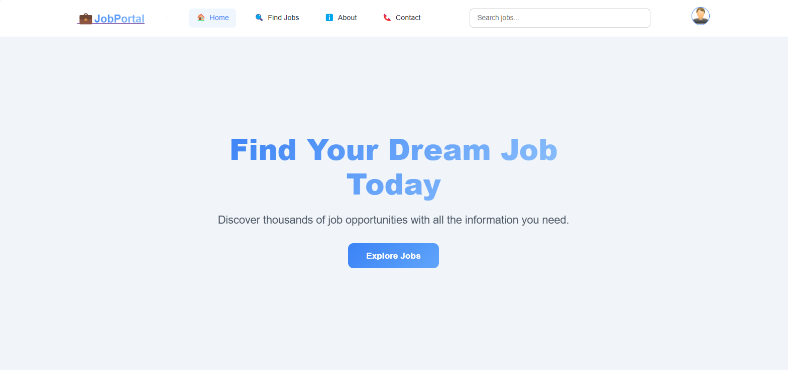
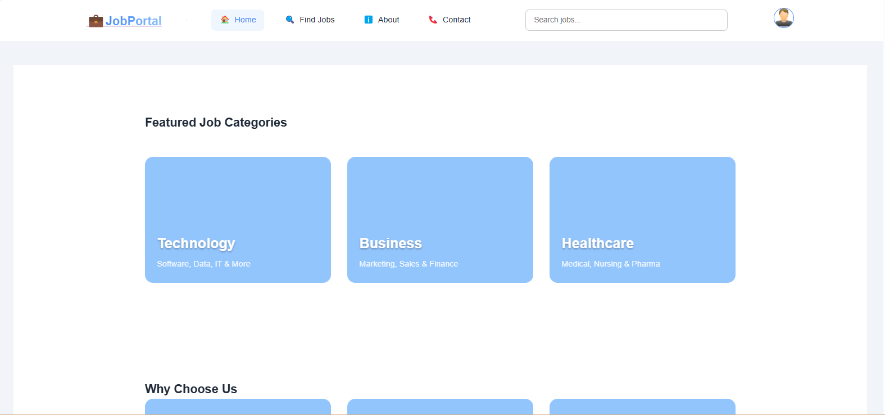
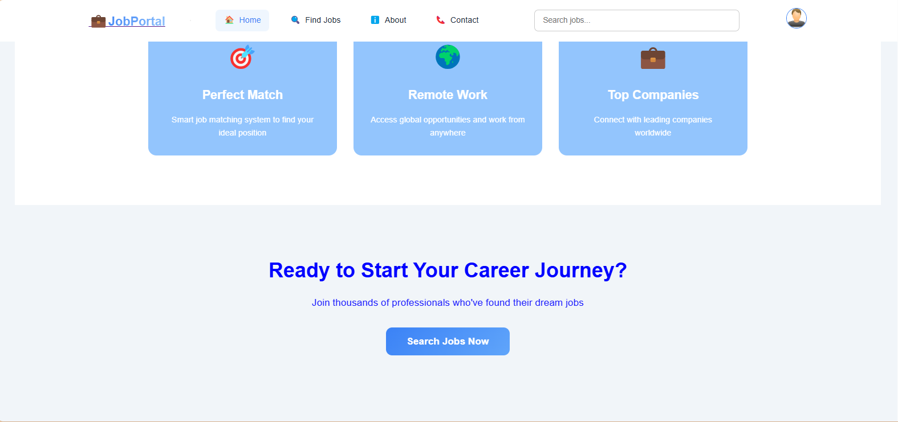
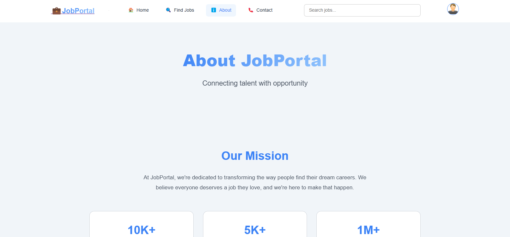
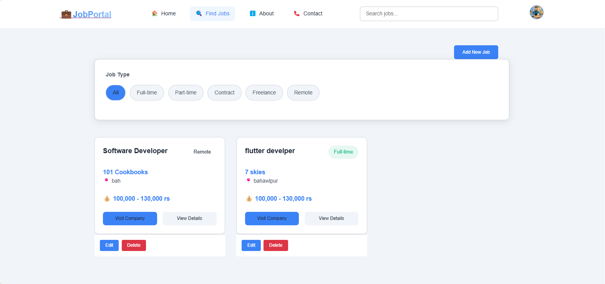
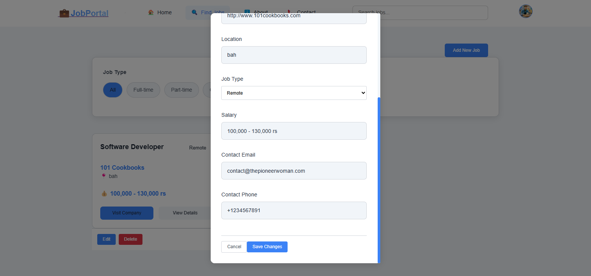
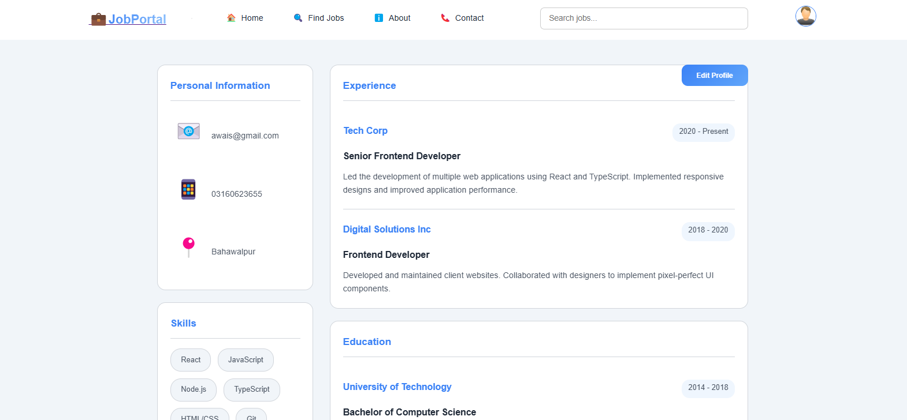
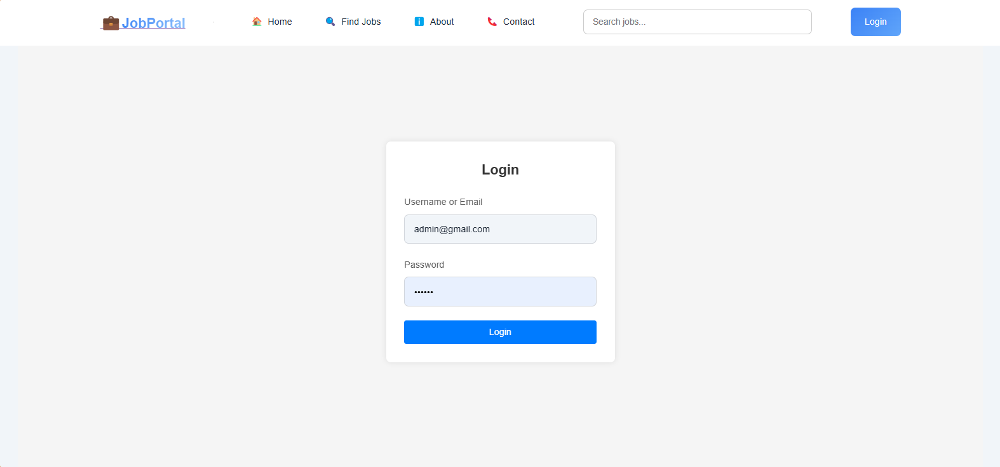

      <h1>  Job Portal</h1>
      <h3>A Modern Job Application Platform</h3>

    
    
    

# 📌 Overview

Job Portal is a modern web application built with React that connects employers and job seekers. It provides a streamlined platform for posting jobs, searching positions, and managing applications efficiently.

# 🛠️ Tech Stack

## 📸 Screenshots

### Home Page

  
  
  
  

### About Page

  
  

### Job Management

  
  
  
  
  

### User Features

  
  

### Profile Management

  
  
  

### Authentication & Contact

  
  

## 🔑 Key Features

### For Job Seekers

- Browse and search job listings
- Filter jobs by type (Full-time, Part-time, Remote, etc.)
- Easy application process
- Profile management
- Track applied jobs

### For Employers/Admin

- Post new job opportunities
- Edit and manage job listings
- View applicant profiles
- Manage user accounts

### General Features

- Responsive design for all devices
- User-friendly interface
- Secure authentication
- Contact support system

## 🚀 Getting Started

1. Clone the repository

2. Install dependencies

3. Run the development server

## 👨‍💻 Developer Contact

Feel free to reach out for any questions or collaboration:

- GitHub: [@jamalihassan0307](https://github.com/jamalihassan0307)
- LinkedIn: [jamalihassan0307](https://www.linkedin.com/in/jamalihassan0307)

## 🙏 Acknowledgments

Special thanks to:

- React.js community
- Tailwind CSS team
- All contributors and supporters
